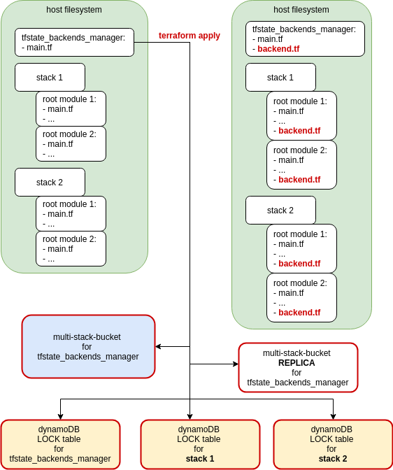
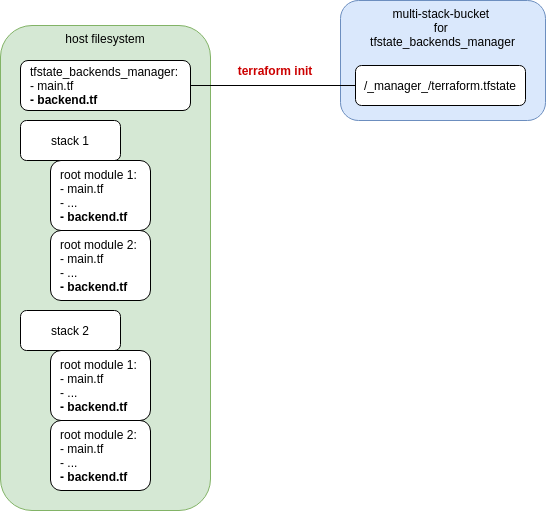
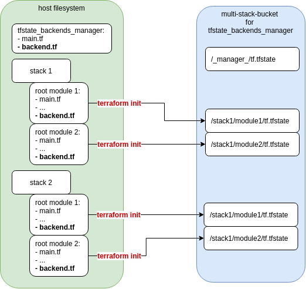
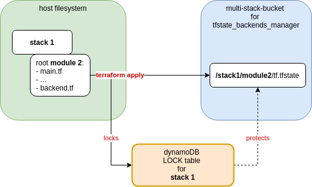

This example demonstrates a basic usage of this module. 

On a system, you have a root module tfstate-s3-manager which 
includes terraform-aws-multi-stack-backends, and the main.tf
defines the stacks to manage: 

- there are 2 stacks, each with 2 root modules, so a total of
  4 folders
- the structure of the folder is irrelevant, as they are 
  specified by path so wherever they are located on the local 
  system, is where terraform-aws-multi-stack-backends will 
  look for them
  
First you `terraform apply` each root module of each stack. 
The order does not matter. 

Then `terraform apply` in the `tfstate-s3-manager` root module, 
which will create the common bucket, its replica, dynamodb 
lock table, IAM policy etc, *as well as all the backend.tf*
files (one for each root module of each stack, specified 
in the `main.tf`). See the following diagram. 

Then you should (although this is optional) move the 
`tfstate-s3-manager` tfstate to s3, by running `terraform init`
for that root module. This can be done before or after step 3.

Finally you can go to each stack's root module's and `terraform
init`. This will move each stack's root module's tfstate from
local host to s3, using the `backend.tf` generated by the 
`tfstate-s3-manager`. See the following diagram. 

From then on, whenever you `terraform apply` in one of the 
root modules associated with a stack, the *whole stack* will 
get locked. See the following diagram. 

